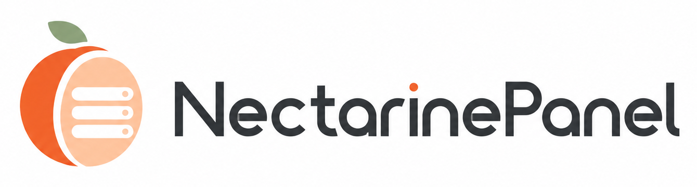
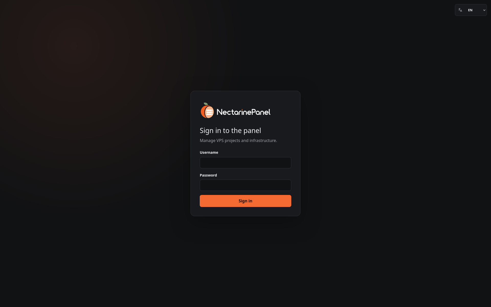
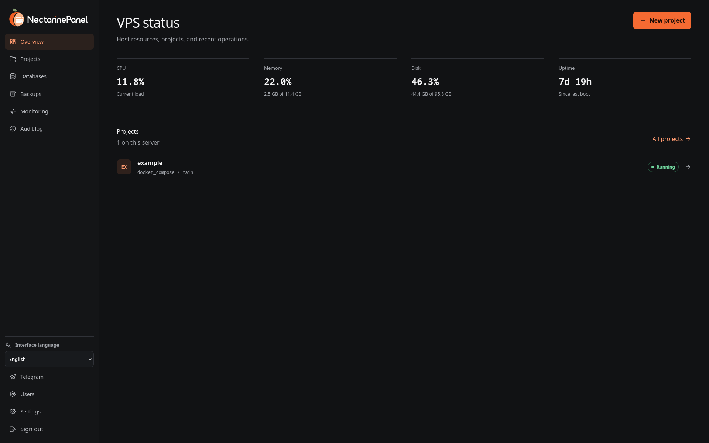
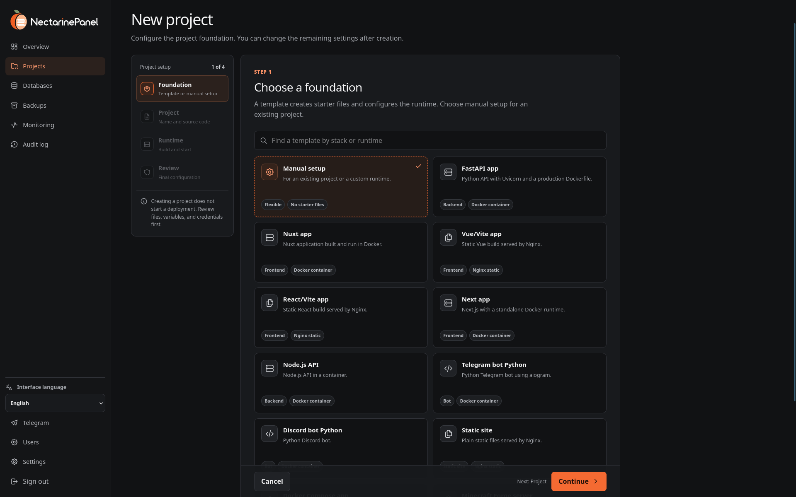
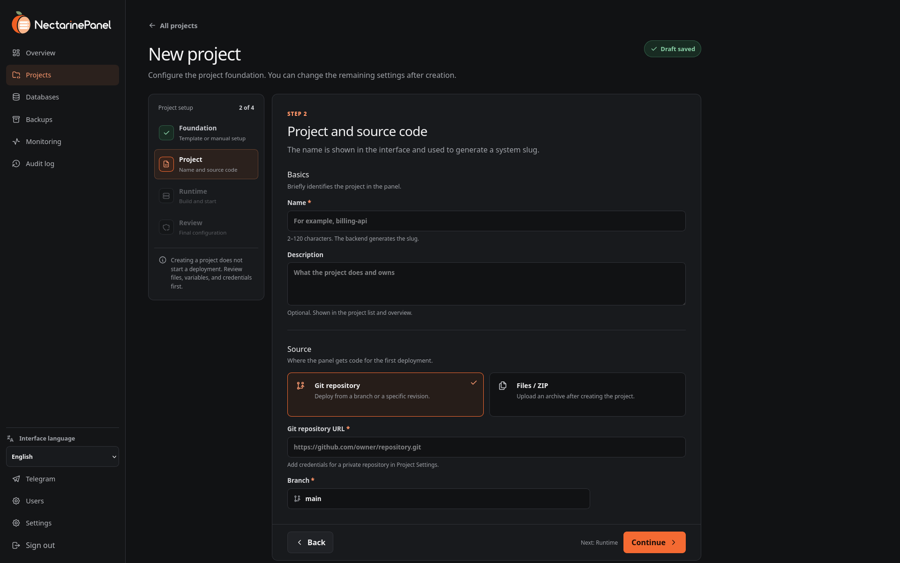
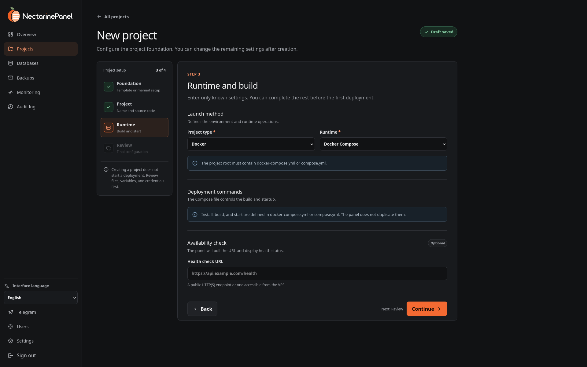
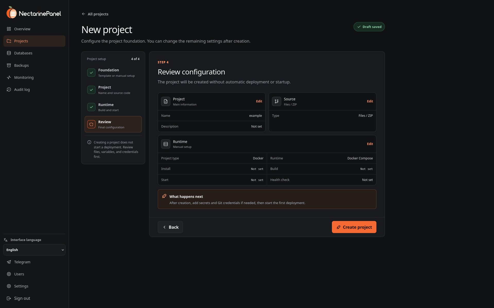
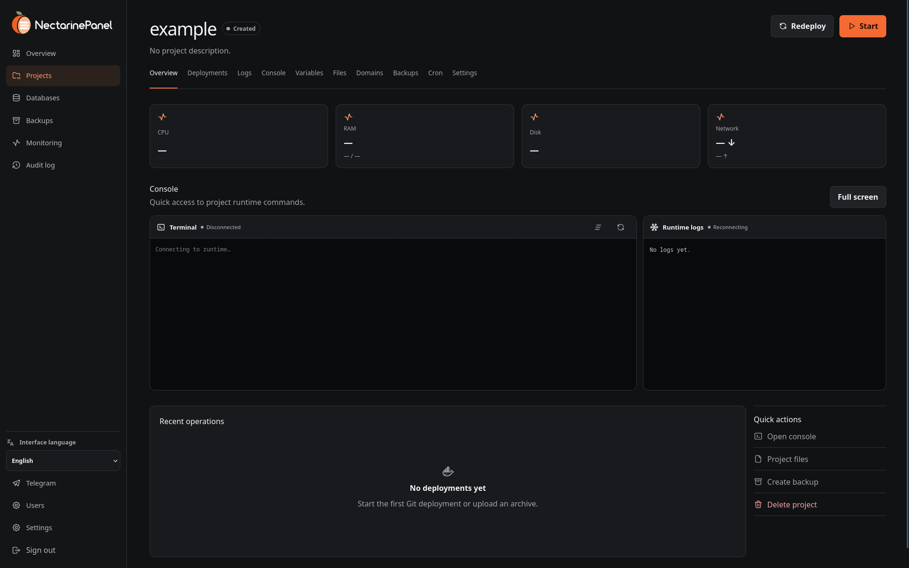

<p align="center">
  <picture>
    <source media="(prefers-color-scheme: dark)" srcset="./nectarinepanel_dark_logo_wordmark.png">
    
  </picture>
</p>

<p align="center">
  Самостоятельно размещаемая панель развёртывания и управления приложениями на одном VPS.
</p>

<p align="center">
  <a href="README.md">English</a> · <a href="README.uk.md">Українська</a> ·
  <strong>Русский</strong> · <a href="README.pl.md">Polski</a>
</p>

> [!IMPORTANT]
> NectarinePanel пока не достиг версии 1.0 и получает привилегированный доступ к
> серверу. Перед обновлением проверяйте процедуру восстановления, храните
> резервные копии за пределами VPS и устанавливайте релизы с тегами, а не код из
> постоянно меняющейся ветки.

## Что это

NectarinePanel разворачивает и обслуживает сайты, API, ботов,
Docker-приложения и серверы Minecraft Forge на одном Ubuntu VPS. FastAPI
отвечает за авторизацию и состояние, Celery выполняет долгие задачи, а
локальный системный агент — за заранее определённые привилегированные операции.

Основные возможности:

- развёртывание из Git и ZIP, приватные репозитории, веб-перехватчики GitHub,
  история релизов, логи и откат;
- Docker, Docker Compose, статический Nginx, systemd, PM2 и Minecraft Forge;
- запуск, остановка, перезапуск, консоль, cron, файловый менеджер, SFTP, домены и
  сертификаты Let's Encrypt;
- PostgreSQL, MySQL/MariaDB, SQLite, Redis/Valkey, дамп, импорт, восстановление и
  защищённый Adminer;
- резервные копии проектов и панели с контрольной суммой, манифестом, сроком хранения и необязательным
  шифрованием;
- мониторинг VPS и проектов, проверки работоспособности, предупреждения и
  уведомления Telegram;
- зашифрованное управление секретами: маскирование, аудит просмотра, версии,
  импорт `.env` и откат;
- роли `owner`, `admin`, `maintainer`, `viewer` и доступ на уровне проектов;
- ограничения процессора и памяти, а также мониторинг лимита диска.

## Скриншоты

Интерфейс выполнен в тёмном стиле панели управления. Ниже показан основной
сценарий — от входа до создания проекта и его эксплуатации:

<p align="center">
  
  
</p>
<p align="center">
  
  
</p>
<p align="center">
  
  
</p>
<p align="center">
  
</p>

## Архитектура

```text
Browser -> Nginx -> Nuxt
                 -> FastAPI -> PostgreSQL
                            -> Valkey -> Celery worker / scheduler
                            -> localhost system agent -> host services / Docker
Telegram -> aiogram -> internal authenticated FastAPI endpoints
```

Серверная часть не предоставляет универсальную оболочку суперпользователя.
Системные изменения проходят через аутентифицированный агент, типизированные
операции, фиксированные аргументы команд и проверку границ файловых путей.

Подробнее: [архитектура](docs/ru/architecture.md) и
[безопасность](docs/ru/security.md).

## Требования

Рабочая среда:

- Ubuntu 24.04 LTS на отдельном VPS;
- домен с A/AAAA записью на адрес VPS;
- доступ суперпользователя или sudo;
- минимум 2 GB RAM и 20 GB свободного диска без учёта приложений.

Разработка:

- Python 3.12+;
- Node.js 22.22.2 LTS, 24.15+ LTS или 26+;
- npm 10+;
- Docker Engine с Compose v2.

## Установка в рабочей среде

Проверьте установщик, клонируйте релиз с тегом и запустите от имени
суперпользователя:

```bash
git clone --branch v0.1.0 --depth 1 \
  https://github.com/JanekDeveloper/NectarinePanel.git
cd NectarinePanel
sudo ./installer/install.sh \
  --domain panel.example.com \
  --email admin@example.com
```

Если не указать `--admin-password`, установщик сгенерирует пароль и покажет его
один раз. Он настроит PostgreSQL/Redis, отдельных системных пользователей,
systemd, Nginx, TLS, системный агент и первого владельца.

После публикации тегированного релиза доступна установка одной командой:

```bash
curl -fsSL \
  https://raw.githubusercontent.com/NectarinePanel/NectarinePanel/v0.1.0/installer/install.sh \
  | sudo bash -s -- --domain panel.example.com --email admin@example.com
```

Не заменяйте тег на `main` в команде суперпользователя. Все параметры описаны в
[docs/ru/installation.md](docs/ru/installation.md).

## Первый проект

1. Войдите с данными владельца, которые показал установщик.
2. Откройте **Проекты → Новый проект** и выберите шаблон или среду выполнения.
3. Добавьте URL Git или ZIP. Для приватного GitHub используйте токен с
   ограниченным доступом или ключ развёртывания только для чтения.
4. Храните секреты во вкладке **Переменные**, а постоянные данные контейнера —
   в каталоге, смонтированном из `shared/`.
5. Запустите развёртывание во вкладке **Деплои**, добавьте домен и TLS.
6. Настройте политику резервного копирования и обязательно проверьте восстановление.

## Локальная разработка

```bash
cp .env.example .env
docker compose up --build
docker compose exec backend python -m app.cli create-admin --username admin
```

Панель: `http://localhost:3000`, OpenAPI:
`http://localhost:8000/api/v1/docs`. Порты разработки доступны только через
локальный интерфейс. Эта конфигурация не предназначена для рабочей среды.

Разработка без контейнеров:

```bash
python3 -m venv .venv
make setup
make migrate
make backend
make frontend
```

## Проверки

```bash
make lint
make test
make build-frontend
make audit-frontend
make compose-check
```

`make check` запускает полную локальную проверку. GitHub Actions проверяет
Python, интерфейс, установщик, Compose и образы Docker в каждом запросе на
слияние.

## Обновление и удаление

```bash
sudo /opt/nectarine-panel/installer/update.sh
sudo /opt/nectarine-panel/installer/uninstall.sh
```

Удаление сохраняет конфигурацию и данные, пока явно не подтверждён `--purge`.
Программа обновления создаёт аварийную резервную копию до миграций и замены
сервисов.

## Текущие ограничения

- один Ubuntu VPS без многосерверного управления;
- хранилище резервных копий локальное — важные копии нужно выносить с VPS;
- политика ресурсов Docker Compose работает только для мониторинга;
- лимит диска создаёт предупреждение, но не квоту файловой системы;
- автоматизации Cloudflare DNS нет;
- веб-интерфейс и основные руководства пользователя и разработчика доступны на
  английском, украинском, русском и польском языках.

## Документация

- [Руководство пользователя](docs/ru/user-guide.md) — развёртывание и управление
  проектами через веб-интерфейс;
- [Руководство разработчика](docs/ru/developer-guide.md) — архитектура,
  локальное окружение, разработка, тесты, установка, релизы и диагностика;
- другие языки: [English](docs/en/user-guide.md),
  [Українська](docs/uk/user-guide.md), [Polski](docs/pl/user-guide.md).

Технические справочники:

[Установка](docs/ru/installation.md) · [Архитектура](docs/ru/architecture.md) ·
[Безопасность](docs/ru/security.md) · [Проекты](docs/ru/projects.md) ·
[Базы данных](docs/ru/databases.md) · [Бэкапы](docs/ru/backups.md) ·
[Мониторинг](docs/ru/monitoring.md) · [Telegram](docs/ru/telegram.md) ·
[Minecraft Forge](docs/ru/minecraft-forge.md) ·
[Разработка](docs/ru/development.md) · [Выпуск версий](docs/ru/releasing.md)

Перед запросом на слияние прочитайте [CONTRIBUTING.md](CONTRIBUTING.md). Уязвимости
отправляйте приватно по правилам [SECURITY.md](SECURITY.md).

Лицензия: [MIT](LICENSE).
